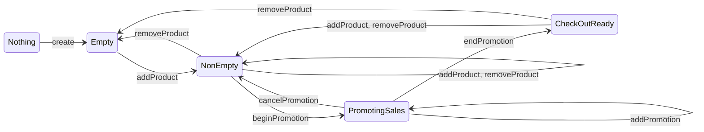

# state

```mermaid
stateDiagram-v2
direction LR

Nothing --> Empty : create

Empty --> NonEmpty : addProduct

NonEmpty --> NonEmpty : addProduct, removeProduct
NonEmpty --> Empty : removeProduct
NonEmpty --> PromotingSales : beginPromotion

PromotingSales --> PromotingSales : addPromotion
PromotingSales --> NonEmpty : cancelPromotion
PromotingSales --> CheckOutReady : endPromotion

CheckOutReady --> NonEmpty : addProduct, removeProduct
CheckOutReady --> Empty : removeProduct
```